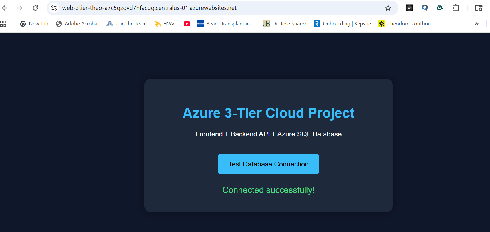
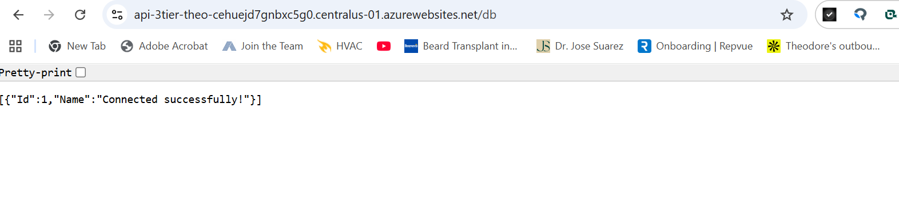
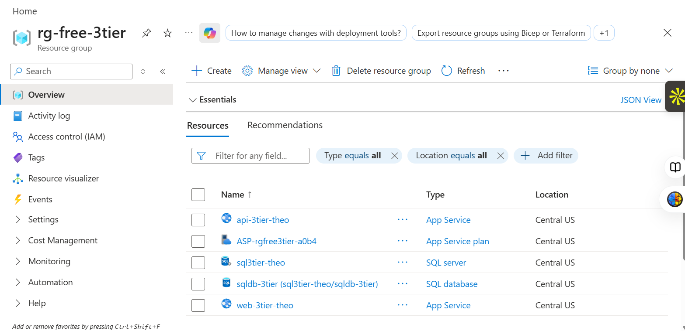
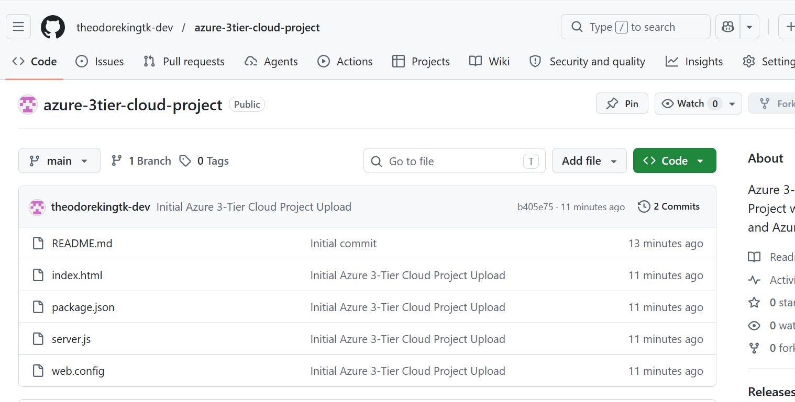

# Azure 3-Tier Cloud Project

## Project Overview
This project demonstrates a full Azure 3-tier cloud architecture using:

- Frontend Web App
- Backend API
- Azure SQL Database
- Azure App Services
- GitHub Deployment

The project successfully connects a frontend application to a backend API and Azure SQL Database.

---

# Architecture

Frontend → Backend API → Azure SQL Database

---

# Technologies Used

- Microsoft Azure
- Azure App Service
- Azure SQL Database
- Node.js
- HTML/CSS
- GitHub

---

# Live Frontend

Frontend successfully deployed on Azure App Service.

---

# API Test

The backend API successfully connects to Azure SQL Database and returns live JSON results.

---

# Project Screenshots

## Frontend Success

---

## API Database Test

---

## Azure Resources

---

## GitHub Repository

---

# Skills Demonstrated

- Cloud Infrastructure Deployment
- Azure Networking
- SQL Database Connectivity
- Full Stack Cloud Architecture
- Troubleshooting & Debugging
- GitHub Version Control
- Azure App Services
- Environment Variables
- API Development

---

# Author

Theodore King
